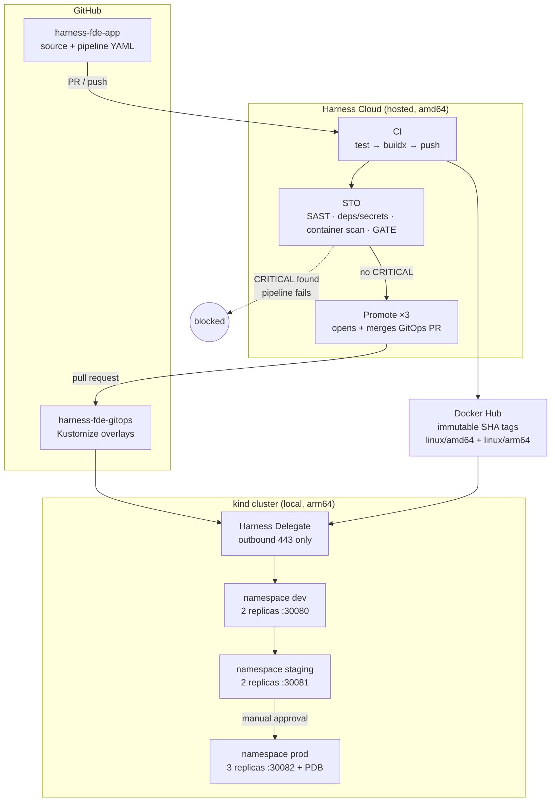

# harness-demo-app — CI/CD + Security Gating on Harness

End-to-end CI/CD pipeline with integrated security testing, built on **Harness Free Tier**,
deploying to a **local kind cluster** across three environments.

A commit to `main` is built once, scanned, and then promoted `dev → staging → prod` by pull
request. Any **CRITICAL** vulnerability stops the pipeline before anything is deployed.

| | |
|---|---|
| **Application** | Node.js 22 + Express 5, `/` and `/health` |
| **Registry** | `docker.io/sharmaamanrajesh/harness-demo-app` (public, multi-arch) |
| **Manifests** | [sharmaamanrajesh/harness-fde-gitops](https://github.com/sharmaamanrajesh/harness-fde-gitops) |
| **Cluster** | kind `harness-demo` — 1 control-plane + 2 workers, k8s v1.35 |
| **Environments** | `dev` (:30080) · `staging` (:30081) · `prod` (:30082) |

---

## 1. Architecture



### Why the split between Harness Cloud and a local delegate

**Harness Cloud runners cannot reach a cluster on a laptop.** They live in Harness's network;
kind sits behind NAT on my machine. Rather than expose the cluster, the **Harness Delegate runs
inside the kind cluster** and polls Harness outbound over 443 — no inbound firewall rules, no
tunnel, no public endpoint.

So the work is split by what each side can actually reach:

| Stage | Runs on | Why |
|---|---|---|
| CI, STO, Promote | Harness Cloud | Needs internet: registry, Trivy DB, GitHub API |
| CD | Delegate in-cluster | Needs the Kubernetes API and cluster DNS |

A useful consequence: the post-deployment health check runs on the delegate, so it can call
`http://harness-demo-app.dev.svc.cluster.local/health` — an address unreachable from hosted CI.

---

## 2. Pipeline

Nine stages. The first two run on every pull request; the rest only after merge.

| # | Stage | Type | Runs on PR? | What it does |
|---|---|---|---|---|
| 1 | **CI** | CI | ✅ | Clone, `npm ci && npm test`, multi-arch buildx build, push tagged with commit SHA |
| 2 | **STO** | CI | ✅ | Semgrep SAST · Trivy deps/secrets/misconfig · Trivy container scan · **security gate** |
| 3 | Promote to Dev | CI (template) | ❌ | Opens + merges a GitOps PR bumping `overlays/dev` |
| 4 | CD | Deployment | ❌ | Rolling deploy to `dev`, then `/health` validation |
| 5 | Promote to Staging | CI (template) | ❌ | Same template, `targetEnv: staging` |
| 6 | CD - Staging | Deployment | ❌ | Rolling deploy to `staging` + validation |
| 7 | **Approve Production** | Approval | ❌ | Manual gate |
| 8 | Promote to Prod | CI (template) | ❌ | Same template, `targetEnv: prod` |
| 9 | CD - Prod | Deployment | ❌ | Rolling deploy to `prod` + validation |

Stages 3–9 carry `condition: <+trigger.event> != "PR"`.

### Build once, promote everywhere

The image is built and scanned **exactly once**, in stage 1. Promotion never rebuilds — it moves
a tag pointer:

```diff
--- a/overlays/staging/kustomization.yaml
+++ b/overlays/staging/kustomization.yaml
-    newTag: "bootstrap"
+    newTag: "931c1d2066134dde998433002902d36aaa2d92a2"
```

That one-line diff *is* a promotion. What passed the security gate is byte-identical to what
reaches production.

Environments are **directories on one branch**, not long-lived branches. Branch-per-environment
causes drift and tangles config changes with promotions; with overlays,
`diff -r overlays/dev overlays/prod` shows every difference at a glance.

### Post-deployment validation

Each CD stage ends with an HTTP step asserting **both**:

```
<+httpResponseCode> == 200 && <+json.select("version", httpResponseBody)> == "<+codebase.commitSha>"
```

Checking the status code alone is not enough — the *previous* release would also return 200 and a
failed rollout would pass unnoticed. Asserting the version proves the build just deployed is the
one serving traffic.

---

## 3. How security gating works

### The scans

| Step | Tool | Scope | Blocking |
|---|---|---|---|
| SAST Scan | Semgrep OSS | `p/javascript`, `p/nodejs`, `p/owasp-top-ten` | report-only |
| Dependency and Secret Scan | Trivy `fs` | vulns, secrets, misconfig | report-only |
| Container Scan | Trivy `image` | full LOW→CRITICAL report | report-only |
| **Security Gate** | Trivy `image` | **CRITICAL only** | **blocking** |

### The gate

```sh
trivy image --scanners vuln --severity CRITICAL --exit-code 1 --no-progress "$IMAGE"
```

A non-zero exit fails the step, which fails the stage, which stops the pipeline. Nothing is
promoted and nothing is deployed.

Reporting and enforcement are **separate steps on purpose**: the Container Scan step prints the
full severity table with `--exit-code 0` for visibility, and the Security Gate step re-scans
CRITICAL-only to enforce. The execution graph then shows unambiguously which step is the gate.

There is deliberately **no `--ignore-unfixed`**. The requirement is to fail on *any* CRITICAL, so
the gate is literal. See trade-offs for why that is not what I would ship to production.

### It has been proven in both directions

- **Blocks:** [PR #1](https://github.com/sharmaamanrajesh/harness-fde-app/pull/1) downgraded the
  base image to `alpine:3.12` (`CVE-2022-37434`, CRITICAL, zlib). GitHub shows
  `harness_fde_cicd-ci = SUCCESS`, `harness_fde_cicd-sto = FAILURE`, deploy stages skipped.
- **Passes:** every green run on `main` ends with `PASSED: no CRITICAL vulnerabilities found`.

### It caught a real vulnerability, unprompted

The first pipeline run failed the gate on **`CVE-2026-59873`** — CRITICAL in `tar` 7.5.11 at
`/usr/local/lib/node_modules/npm/node_modules/tar`. That is **npm's own bundled copy**, inherited
from `node:22-alpine`. The application's dependencies and the Alpine OS layer both scanned clean,
and npm is never executed at runtime.

Three options: suppress it with `.trivyignore`, use `--ignore-unfixed` (inapplicable — 7.5.19
exists), or remove the attack surface. **I removed it.** The runtime image is now plain
`alpine:3.24` with only the Node binary and its two musl shared libraries copied in — no npm, no
yarn, no corepack.

**Distroless was evaluated and rejected**, with evidence: `gcr.io/distroless/nodejs22-debian12`
cleared the npm finding but introduced `CVE-2026-31789` (CRITICAL, `libssl3`), and it ships no
`/bin/sleep`, which would have silently broken the `preStop` hook the zero-downtime rollout
depends on.

Image size: 234 MB → **196 MB**.

---

## 4. Setup from scratch

### Prerequisites

Docker Desktop (≥ 8 GB RAM), `kubectl`, `kind`, `helm`, `gh`, Node 22+.

### 1. Cluster

`extraPortMappings` must be declared at creation time and on a **worker** — kubeadm taints the
control plane, so workloads land on workers only.

```bash
kind create cluster --config cluster/kind-harness.yaml
kubectl create namespace dev
kubectl create namespace staging
kubectl create namespace prod
```

### 2. Harness delegate

```bash
helm repo add harness-delegate https://app.harness.io/storage/harness-download/delegate-helm-chart/
helm repo update harness-delegate

helm upgrade -i kind-delegate --namespace harness-delegate-ng --create-namespace \
  harness-delegate/harness-delegate-ng \
  --set delegateName=kind-delegate \
  --set accountId=<HARNESS_ACCOUNT_ID> \
  --set delegateToken=<DELEGATE_TOKEN> \
  --set managerEndpoint=https://app.harness.io \
  --set delegateDockerImage=us-docker.pkg.dev/gar-prod-setup/harness-public/harness/delegate:26.07.89601 \
  --set replicas=1 --set upgrader.enabled=false --set cpu=0.5
```

Wait for `1/1 Running` **and** "Connected" in the Harness UI — a running pod that never registers
usually means a wrong token or manager endpoint, and that failure is invisible from `kubectl`.

### 3. Harness configuration

**Secrets** (Project Settings → Secrets): `dockerhub_token`, `github_pat`.
The GitHub PAT needs `repo` **and** `admin:repo_hook` — without the latter, triggers silently
never fire.

**Connectors:**

| Name | Type | Notes |
|---|---|---|
| `github` | GitHub, **Account-level** | API access enabled; serves both repos |
| `dockerhub` | Docker Registry | Connect through Harness Platform |
| `k8s_kind` | Kubernetes | Uses delegate credentials |

**Service / Environments / Infrastructure:** service `harnessdemoapp` reads Kustomize manifests
from the GitOps repo at `overlays/<+env.name>` — one service definition serves all three
environments. Then environments `dev`, `staging`, `prod` (prod as `Production`), each with a
`KubernetesDirect` infrastructure definition pointing at its namespace.

**Templates:** import `.harness/templates/gitops-promotion.yaml`, then the pipeline from
`.harness/pipeline.yaml`.

**Triggers:** a Pull Request trigger on `harness-fde-app` targeting `main`.

### 4. Verify

```bash
for ns in dev staging prod; do
  port=$([ $ns = dev ] && echo 30080 || { [ $ns = staging ] && echo 30081 || echo 30082; })
  curl -s localhost:$port/health; echo
done
```

All three should report the **same `version`** and a **different `environment`**.

---

## 5. Design decisions and trade-offs

### Multi-arch images are mandatory here, not optional

Harness Cloud runners are amd64; the kind nodes are arm64 (Apple Silicon). A single-platform
build produces an image the cluster can never run — and it fails at *pull* time, not with an
`exec format error`:

```
failed to pull and unpack image "...": no match for platform in manifest: not found
```

The build publishes `linux/amd64,linux/arm64`. To keep that cheap, the dependency stage is pinned
to `--platform=$BUILDPLATFORM` (so `npm ci` runs natively) and the runtime stage contains **no
`RUN` at all** — so cross-building needs no QEMU emulation and no privileged `binfmt` step.
Caveat: this works because every dependency is pure JavaScript; a native module would require
real per-architecture builds.

### Why `Run` steps instead of the built-in Build-and-Push step

`BuildAndPushDockerRegistry` publishes a single-platform image. Given the constraint above, buildx
had to be driven directly. The build step also emits SBOM and SLSA provenance attestations
(`--sbom=true --provenance=mode=max`).

### "Fail on ANY CRITICAL" is operationally brittle

Implemented literally, as specified. But on the day I built this, **both** candidate base images
carried a CRITICAL: `node:22-alpine` via npm's `tar`, and distroless via `libssl3`. Base images
routinely ship CRITICALs that are unfixable until upstream rebuilds and often unreachable in your
runtime.

In production I would keep the same gate but pair it with a **documented, time-boxed, reviewed
exception process** — otherwise the gate stops being a security control and starts being
something teams route around.

Related: the gate is also *narrow*. My first attempt at a deliberately vulnerable PR used
`alpine:3.16`, which scanned `MEDIUM: 2, HIGH: 2, CRITICAL: 0` — and sailed straight through.
A CRITICAL-only threshold ignores an image with several HIGH findings.

### Rolling updates: measured, then fixed

`maxUnavailable: 0` with `maxSurge: 1`, plus readiness probes and graceful SIGTERM handling.

Measured across a rolling update: **6 failed requests out of 6,409.** Graceful shutdown alone is
insufficient — Kubernetes removes the Endpoint and sends SIGTERM *concurrently*, so kube-proxy
still routes to a pod that has begun draining. Adding a `preStop` sleep so endpoints converge
first brought it to **1 in 8,795**. Not zero; the remaining lever would be a longer `preStop` or
`externalTrafficPolicy: Local`.

### `topologySpreadConstraints` uses `ScheduleAnyway`, deliberately

With 2 replicas on 2 workers, the surge pod during a rollout makes a 2/1 split unavoidable.
`DoNotSchedule` would leave it `Pending` and **deadlock the rollout permanently**.

### Kubernetes has no automatic rollback

A forced failure (`newTag: does-not-exist`) left the Deployment `Available=True` and
`Progressing=False / ProgressDeadlineExceeded` — a status condition and nothing more. The failed
ReplicaSet would have sat there indefinitely. `progressDeadlineSeconds` does not delete, scale
down, or revert anything.

That is why the pipeline owns rollback explicitly: retry with backoff, then `StageRollback` →
`K8sRollingRollback`. Verified: the failed ReplicaSet scaled to 0, the Deployment restored to the
previous image, and the rollback recorded as rollout revision 3 — while the serving pods were never
replaced (145 minutes old, 0 restarts, across a failed deploy and three failed executions).

### Two bugs this exercise exposed in my own configuration

**`rollbackSteps` was nested under `spec` instead of `spec.execution`.** Harness accepted the YAML,
silently ignored the unrecognised key, and every `StageRollback` fired against a stage that had no
rollback steps defined. Nothing warned me — the pipeline validated, saved and ran normally. It
surfaced only when the safety net was needed and wasn't there, and I had initially mis-read an
unrelated redeployment as evidence that rollback worked. **Schema validation passing is not
evidence that a feature is wired up.**

**`errors: [AllErrors]` does not cover step expiry.** A step that runs out of time *expires* rather
than erroring; the pipeline ended `EXPIRED` and no rollback triggered. `Timeout` must be declared
as its own `onFailure` entry — it cannot be combined with `AllErrors` in a single list. A
deployment that hangs rather than fails is precisely the case rollback exists for, so this gap
mattered.

**Known limitation:** `K8sRollingRollback` restores the previous *Harness* release. It does **not**
revert the GitOps repo, so cluster and Git diverge after a rollback and the next sync would
re-apply the bad tag. The correct model is rollback-as-revert-commit, keeping Git the source of
truth.

### Pull requests never deploy

PRs run CI and STO only. The GitOps repo is the source of truth for what is deployed, so only
merged code may change it — otherwise two open PRs would race over the same tag and nobody could
say what is actually running. Per-PR environments are a legitimate pattern, but they belong in an
ephemeral `pr-N` namespace, never in `dev`, which staging and prod are promoted from.

### Auto-merging the promotion PR

`dev` and `staging` auto-merge for a fast inner loop; production is gated by a Harness Approval
before its promotion runs. The template exposes `autoMerge` as an input, so leaving a PR for human
review is a one-value change. `disallowPipelineExecutor: false` is set so a single-person demo can
approve its own run — in a team this would be `true` with a separate approver group.

---

## 6. Assumptions

1. A single kind cluster with three namespaces stands in for three clusters. Real isolation would
   use separate clusters, or at minimum NetworkPolicies between namespaces.
2. The Docker Hub repository is public, so no `imagePullSecrets` are needed.
3. The delegate runs with `cluster-admin` (the Helm chart default). It needs cluster scope to
   deploy into three namespaces; the chart's `NAMESPACE_ADMIN` option would confine it to its own.
   Production answer: a custom ClusterRole limited to Deployment/Service/PDB verbs in those three
   namespaces.
4. PR builds push to the same registry as releases. They are immutable SHA tags and nothing
   deploys them, but production would push PR builds to a quarantine repository and copy on merge.
5. Harness entities are stored **inline**; `.harness/` in this repo is a point-in-time export and
   can drift. Production would use Harness Git Experience so they are PR-reviewed alongside code.

---

## 7. Blockers encountered

**Harness STO is not available on the free tier.** The module page offers only "Trial – Coming
soon" (disabled) and "Contact Sales" — see `evidence/sto-not-available-free-tier.png`. The
built-in `AquaTrivy` step and its `fail_on_severity` setting were therefore unavailable.

**Substitute:** a stage still *named* `STO`, so the pipeline keeps its CI → STO → CD topology,
running Trivy and Semgrep as explicit steps. Arguably a better artefact for review: the failure
condition is one auditable line in version control rather than a UI toggle, and exactly what is
ignored is visible in the diff.

**The red check does not block the merge by itself.** GitHub still reported
`"mergeable": "MERGEABLE"` on PR #1 because no branch protection rule marks
`harness_fde_cicd-sto` as a required status check. Scanning happens before merge; *enforcement*
is repo policy, not pipeline config. Branch protection with required status checks closes it.

---

## 8. What I would do next

- **Supply chain:** sign images with cosign and verify signatures at admission
- **Admission control:** Kyverno or Gatekeeper enforcing non-root, signed images, resource limits
- **Isolation:** NetworkPolicies between namespaces; separate clusters per environment
- **Ephemeral PR environments** in `pr-N` namespaces, torn down on close
- **Rollback as a revert commit** so Git never diverges from the cluster
- **Harness Git Experience** for pipeline and template definitions
- **Observability:** Prometheus + Grafana, and Harness Continuous Verification on deploy
- **Ingress with TLS** instead of NodePort

---

## 9. Repository layout

```
harness-fde-app/
├── src/app.js, src/server.js       Express app, graceful shutdown
├── test/health.test.js             node:test + supertest
├── Dockerfile                      multi-stage, npm-free runtime, non-root 1001:1001
├── cluster/kind-harness.yaml       cluster definition
├── evidence/                       screenshots and captured output
└── .harness/
    ├── pipeline.yaml               exported pipeline
    └── templates/
        └── gitops-promotion.yaml   reusable stage template
```

## 10. Evidence

Harness execution links require access to the `HarnessCI` project. Screenshots of each are in
[`evidence/`](evidence/) so the run is reviewable without an account.

| Artefact | Link |
|---|---|
| **Successful pipeline execution** — all 9 stages green | [execution hOuCk3S8](https://app.harness.io/ng/account/GLZAz1FFTx2Pei5U0q2GAQ/module/cd/orgs/default/projects/HarnessCI/pipelines/harness_fde_cicd/executions/hOuCk3S8SJuhLg-q3Nj_Uw/pipeline?storeType=INLINE) |
| **Security gate failing a PR** — `CVE-2022-37434`, deploy stages skipped | [execution oAgjAYcr](https://app.harness.io/ng/account/GLZAz1FFTx2Pei5U0q2GAQ/module/cd/orgs/default/projects/HarnessCI/pipelines/harness_fde_cicd/executions/oAgjAYcrTEaswfUCYmOD8A/pipeline?storeType=INLINE) |
| **Rollback on a failed deployment** — retry, then `K8sRollingRollback` | [execution hnhFkX0f](https://app.harness.io/ng/account/GLZAz1FFTx2Pei5U0q2GAQ/module/cd/orgs/default/projects/HarnessCI/pipelines/harness_fde_cicd/executions/hnhFkX0fQXmNqW8KGjSTnw/pipeline?storeType=INLINE) |
| Pull request blocked by the gate | [harness-fde-app#1](https://github.com/sharmaamanrajesh/harness-fde-app/pull/1) |
| GitOps promotion PRs — one line each, dev → staging → prod | [harness-fde-gitops PRs](https://github.com/sharmaamanrajesh/harness-fde-gitops/pulls?q=is%3Apr) |

### Captured evidence

```
evidence/00-blockers/          STO module unavailable on the free tier
evidence/01-steady-state/      one artifact across three environments, merged promotion PRs
evidence/02-green-run/         full pipeline, approval gate, zero-downtime measurement
evidence/03-gate-blocks-pr/    red check on the PR, deploy stages skipped
evidence/04-rollback/          ImagePullBackOff, retry, rollback step log, restored state
```

Key measurements, captured rather than claimed:

- `evidence/02-green-run/zero-downtime-probe.txt` — **3,295 requests, 0 failures** across a rolling update
- `evidence/04-rollback/rollback-verified.txt` — rollback restored the previous release; serving pods
  145 minutes old with 0 restarts throughout a failed deployment
